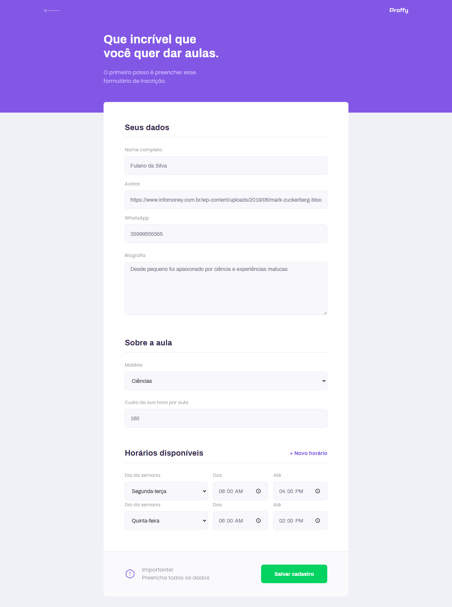
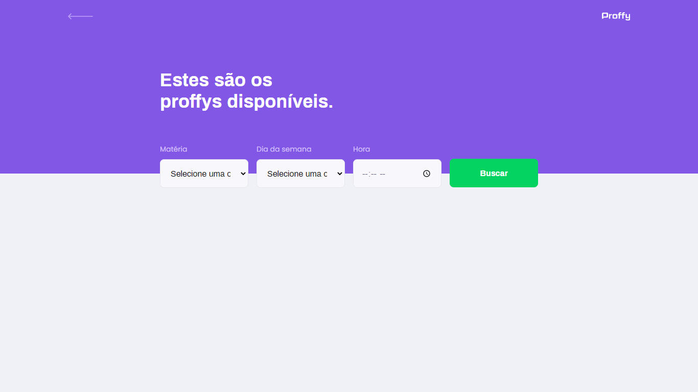
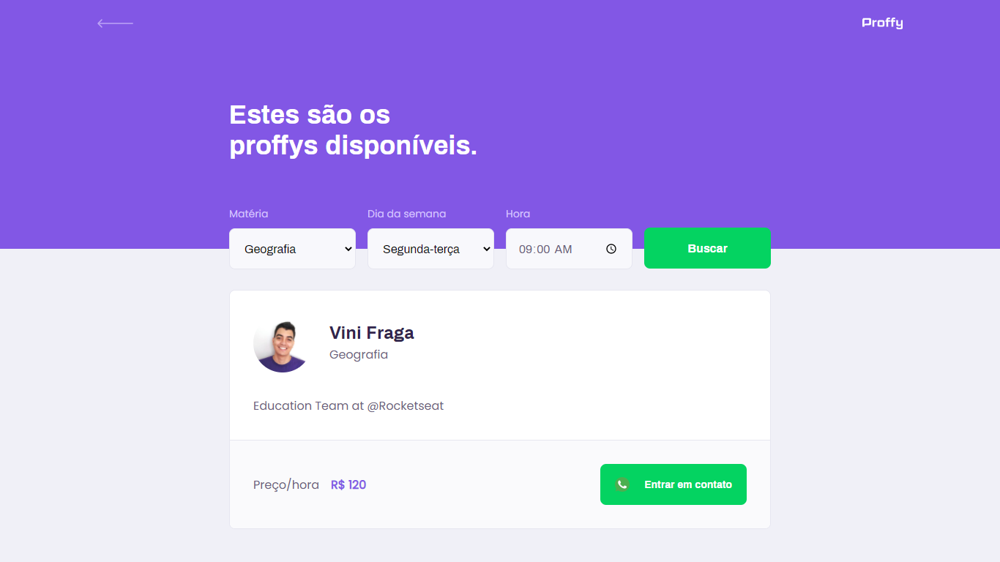
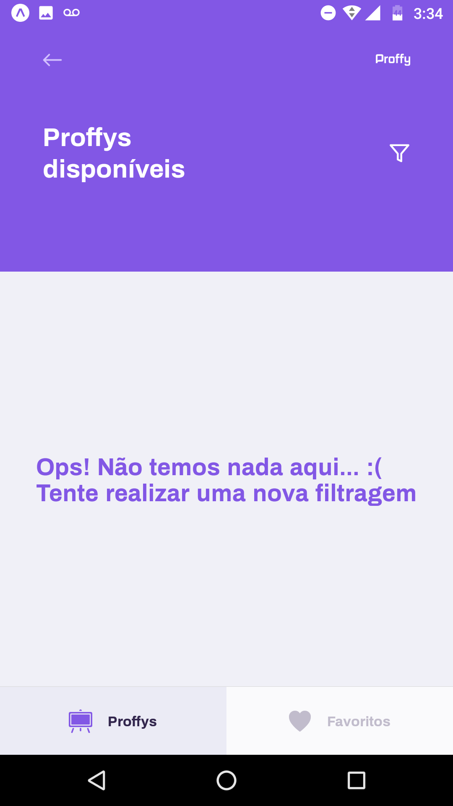

<h1
    align="center"
    style="color: #8257E5;"
>
    👨🏻‍🏫 Proffy: Uma rede de professores e alunos independentes 📚
</h1>

<h3
    style="color: #6842C2;"
>
    Junte-se diversos professores e alunos indepentenes e faça o seu horário, seja você um professor ou um aluno!
</h3>

    Proffy é uma plataforma que conecta diversos professores e alunos indepentenes, basta cadastrar-se, definir o preço das suas aulas, sua agenda e pronto. Ou então, buscar por professores de acordo com suas disciplinas e disponibilidade, caso você queira estudar 😉.

<h4>🛠 Tecnologias e ferramentas: 🛠</h4>
<ul>
    <li>TypeScript</li>
    <li>Node.JS e Knex</li>
    <li>ReactJS</li>
    <li>React Native</li>
    <li>Expo CLI</li>
</ul>

<h4>📷 Capturas de tela: 📷</h4>
<table>
    <tr><td align="center"><strong>Aplicação web</strong></td></tr>
    <tr>
        <td>
            
        </td>
    </tr>
    <tr>
        <td>
            
        </td>
    </tr>
    <tr>
        <td>
            
        </td>
    </tr>
    <tr>
        <td>
            
        </td>
    </tr>
</table>

<table>
    <tr><td colspan="3" align="center"><strong>Aplicação mobile</strong></td></tr>
    <tr>
        <td>
            
        </td>
        <td>
            
        </td>
        <td>
            
        </td>
    </tr>
    <tr>
        <td>
            
        </td>
        <td>
            
        </td>
        <td>
            
        </td>
    </tr>
</table>
